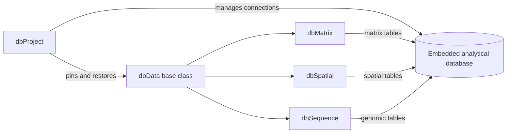

# Architecture

`dbverse` packages share a common architecture. `dbProject` manages database
connections and persistent project state. Scientific data classes build on
`dbData` and store their data in an embedded analytical database.

Architecture of the current R implementation.

